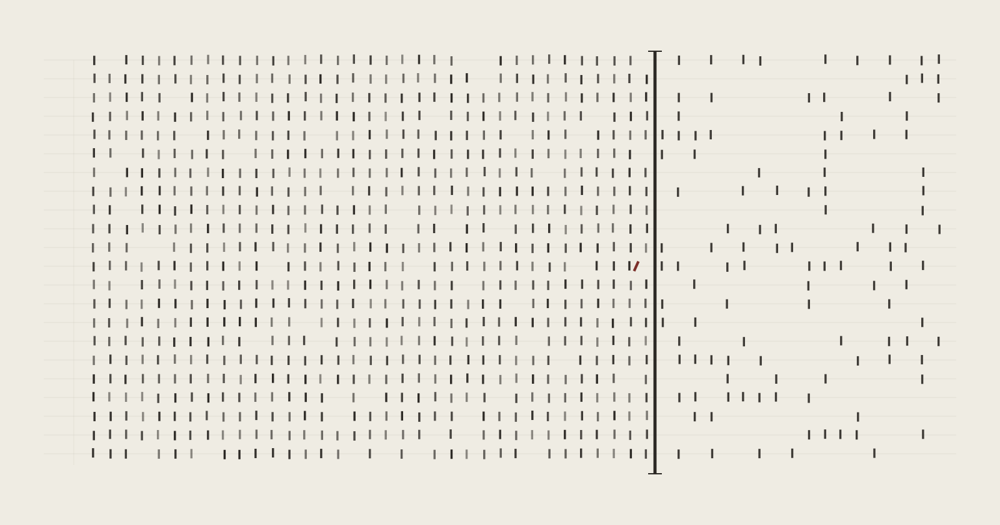

# gated



**A promotion gate that judges what your code *does*, not what it *says*.**

The reference implementation of the [PBGF Conformance Specification](https://moriapp.dev/pbgf-cs) — a standard for promotion verdicts on machine-produced code.

`gated` executes pull-request code inside a hermetic OCI sandbox, observes its
behaviour at the network boundary, and publishes a required GitHub Check. Code
that violates the accepted runtime invariant cannot merge.

The canonical example is a helper that looks like it retries a failed request
but silently swallows the failure — it passes the linter, passes the type
checker, and passes its own tests. The next section walks through exactly that
case, in detail.

> **Status:** reference implementation. The complete mechanism runs against real
> Podman and real GitHub — it has blocked real merges end-to-end — and carries a
> tamper-evident, append-only override ledger that records any merge past a
> failing check. This repository is not a plug-and-play production service or a
> security-complete sandbox. Merge-ready ≠ security-complete ≠ live-proven.

## What this actually does

Take code that is supposed to retry a flaky endpoint. The tempting example looks
like a retry — there is a loop, and a `try`/`except` around the call. But on a
transient failure the `except` returns a truthy placeholder, and the loop treats
a truthy result as success. So it stops after one attempt. It does not retry. It
gives up and returns, quietly.

Its own tests pass. They mock the socket, simulate a 503 and a 200, and check
that a usable value comes back — which it does. They never check that a second
attempt happened. Ruff and mypy pass too: there is nothing malformed
about the file.

In a sealed demonstration run by the companion harness
([gated-uat](https://github.com/fjwood69/gated-uat)), a frontier model reviewing
that same file asked for changes. On the clean counterpart, the same model hit
its output-token limit and returned no verdict at all. On an earlier sealed
board, the reviewer refused to review the request entirely. The review column is
an opinion, and it varies.

Then `gated` ran the real function — not under those mocks — in a container with
no network route except a counting proxy, which the code can reach by one
hard-wired name and cannot inspect or reconfigure. The endpoint fails once, then
succeeds. The proxy counts connections.

Code that retries makes two connections. Code that swallows makes one.

The tempting example made one, and the check failed. The clean one made two, and
passed.

Your test asked whether a usable value came back — it did. `gated` asked whether
the retry happened — it didn't.

## Why runtime, not static

Static analysis reasons about the *text* of a program. Any check that reads
code can be defeated by code written to read one way and run another — and in
agentic workflows, the producer that wrote the code usually wrote the tests
too. `gated` doesn't read the code and doesn't trust the producer's tests: it
runs the artifact under observation and asserts on the **observed boundary
behaviour**. Passing means the behaviour actually happened, not that the
source looked like it would.

## How it works

```text
GitHub webhook
      │
      ▼
durable queue ──▶ policy admission ──▶ hermetic execution
                                           │
                                           ▼
                                  boundary observation
                                           │
                                           ▼
                                PASS / FAIL / ERROR
                                           │
                                           ▼
                              durable publication outbox
                                           │
                                           ▼
                          required GitHub Check + audit ledger
```

The verdict depends only on host-side observations and trusted policy inputs.
**The pull request cannot provide its own policy, fixtures, detector, or
verdict.**

## Core properties

- **Runtime evidence:** assertions evaluate observed behaviour, not source text.
- **Hermetic execution:** the production path uses Podman with sealed
  networking; the only egress is the observed proxy.
- **Fail closed:** `ERROR` — the gate could not cleanly observe — maps to
  GitHub `action_required` and **blocks**. This is the Check-Run surface of
  PBGF-CS's UNATTESTABLE verdict: absence of proof is never a pass. A gate
  that fails open is theatre; `gated` refuses to.
- **Multi-trial unanimity:** N isolated trials (fresh sandbox and network per
  trial). Any `FAIL` fails the verdict — a flaky violation is still a
  violation, so the `FAIL` path short-circuits. `PASS` requires unanimity.
- **Calibration before enforcement:** a detector holds blocking authority only
  after two-sided calibration — it must catch every known-bad fixture *and*
  pass every known-good one.
- **Separated authority:** measurement cannot promote itself into enforcement;
  enablement is a distinct, governed decision.
- **Post-run admission:** results are admitted only if policy, oracle and
  subject identity remain current at admission time.
- **Durable publication:** Check Run updates flow through a transactional,
  retrying outbox; a GitHub outage cannot silently drop a terminal result.

## The override ledger

Branch protection lets an admin merge past a failing required check. `gated`
records that: if a merge went past a non-`PASS` verdict, an **append-only,
hash-chained** record is written — *"the gate verdict was FAIL; the PR merged
anyway."* It records only what the gate itself can attest, never more. Every
merge is then either gate-approved or consciously overridden, with a record.

## Repository layout

- `core/` — shared contracts and value types
- `sandbox/` — subprocess and OCI execution backends
- `observe/` — host-side boundary observation
- `engine/` — trials, aggregation and runtime assertions
- `gate/` — calibration, governance, admission, GitHub App and durable stores
- `cli/` — command-line package
- `tests/` — unit, adversarial and real-Podman tests

See [ARCHITECTURE.md](ARCHITECTURE.md) for trust boundaries, invariants and
known deployment limits, and [COMPLETENESS.md](COMPLETENESS.md) for the
completeness gate every increment passes before it ships.

## Development

Requires Python 3.9 or later.

```bash
git clone https://github.com/<owner>/gated.git
cd gated

python -m venv .venv
source .venv/bin/activate
python -m pip install --upgrade pip
python -m pip install -e .
```

Run the test suite:

```bash
python -W error -m unittest discover -s tests
```

Run the static gates:

```bash
mypy --strict core sandbox engine observe gate cli
ruff check .
python scripts/check-overclaim.py
python scripts/check-sterility.py
```

Tests requiring an OCI runtime self-skip when Podman or the configured test
image is unavailable; the boundary mechanism is exercised in full where one is
present.

## Deployment

The live adapter is in `gate/live_app.py`. A deployment requires:

- a GitHub App with webhook and Checks permissions;
- branch protection requiring the configured Check name;
- Podman and an immutable detector image;
- independently accepted detector-profile and policy identities;
- separate queue, policy, calibration and audit stores;
- protected signing and webhook secrets.

This setup is intentionally not presented as a one-command production install.
Read [ARCHITECTURE.md](ARCHITECTURE.md) before operating the live path.

## Security boundary

`gated` proves the mechanism implemented here; it does not prove the host.

The kernel, OCI runtime, observer, Python process and local key custody remain
trusted. Production hardening requires controls such as isolated detector
processes, externally signed content-addressed artifacts, KMS/HSM-backed keys
and independently managed governance authority.

In particular:

- merge-ready does not mean security-complete;
- security-complete does not mean live-proven;
- identity binding does not attest a compromised host;
- calibration blindness assumes a trusted detector.

The precise claims and residual risks are documented in
[ARCHITECTURE.md](ARCHITECTURE.md).

## Relationship to PBGF-CS

[PBGF-CS](https://moriapp.dev/pbgf-cs) scopes conformance per artifact-boundary
pair (§3), so a claim inheriting from it must name **which path** it covers.
This repository does not yet meet all four requirements, and its coverage
differs between the **calibration/acceptance** path and the
**promotion-verdict** path. Verified against this tree, not asserted:

| §4 requirement | Status in this repository |
|---|---|
| **§4.1** mechanical tier assignment | **Not built.** No per-property tier record exists — no candidate check, no transformation/evasion attempts with outcomes, no revalidation date. Tiers are not emitted at all. |
| **§4.2** authority earned by two-sided calibration | **Demonstrated** on the calibration path. The signed measurement binds detector digest, corpus identity (`set_id` + `oracle_head` + `coverage_digest`), measured execution identity, and coverage and failure partitions covering **both** sides; authority is granted by a dual-principal governance approval recorded in an append-only chain. |
| **§4.3** bound and preregistered verdicts | **Partial.** **Preregistration is absent** — no expectation is committed and signed before execution on either path. (For calibration only, ground-truth labels are sealed before the run and compared after: expectation-before-execution in substance, but not a preregistration record.) Binding, refutation-representability and admissibility comparison are demonstrated on the **calibration/acceptance** path (an Ed25519 coordinate-bound envelope); the **promotion-verdict** path is thinner — verdicts persist as store rows plus a Check Run, not as that envelope. Provenance is distinguished structurally as measured-subject versus reported-context, not as the specification's three-class typed vocabulary. |
| **§4.4** absence of proof fails closed | **Partial.** `UNATTESTABLE` names the specific unestablished element (typed refusal reasons), is distinct from `FAIL`, and infrastructure failure is explicitly refused as evidence that enforcement occurred. But freshness bounds are declared for the snapshot input only, not per input across every consumed input, so the evidence clause is not fully met. |

**Conformance posture: below Level 1.** Level 1 requires all four requirements
met; §4.1 is not built and §4.3 preregistration is absent. Claiming Level 1
would be false, so this repository does not claim it.

**Current state of this tree: recalibration pending.** The proxy/readiness fix
in this history materially changed the measured observer identity — a
coordinate of the attested `ExecutionIdentity` — and the identity goldens were
re-pinned to match (`9e2b216a…` → `2a7f8953…`). **Calibration was not re-run
under the new identity.** Re-pinning a golden accepts a new environment
identity; it does not re-establish authority under it, and PBGF-CS §4.2(4)
requires recalibration after a material change to the detector's environment
before authority resumes. So any deployment that was ENABLED under the previous
observer identity and upgrades past that commit is **UNATTESTABLE until
recalibrated** — the specified behaviour rather than a regression, but stated
here rather than left to be discovered. The mechanism is not advisory: an
enforcement run under a changed observer recomputes a measured subject that no
longer equals the authorized one, and admission refuses it.

This is a different claim surface from the sealed UAT boards, which pin this
engine at a commit predating the change and are historical under that pin. A
board result is evidence about the environment it ran in, and is not carried
forward across an identity change.

One reading is deliberately declined. §4.3 requires preregistration "where the
evaluation is scenario-based", and a promotion verdict on unknown real code is
arguably not scenario-based — on which reading this repository's §4.3 position
would improve. The strict reading is applied here instead: the specification's
own authors should not raise their implementation's score by reinterpreting
their own conditional, which is the shape of loosening a requirement from
friction. The conditional is raised as a clarification question for a future
minor version of the specification (§8), to be settled at arm's length.

Where the evidence lives matters too. The calibration and governance records
are signed and retained, but in operator-host stores with no export surface —
queryable **by the operator**, not inspectable by a third party. That is the
Level 1 versus Level 3 distinction, and it is not closed here. Level 2
(enforced producer/judge separation, signing keys outside the evaluated
workload) and Level 3 (an interoperable envelope, execution identity rooted
outside the operator, a calibration record reproducible from a published corpus
digest) require the deployment hardening described above; this repository emits
no in-toto/DSSE envelope.

### What a conforming verdict does not claim (§7)

A conforming verdict does not claim that the artifact is free of defects; that
harms outside the calibrated corpus were caught; that behaviour observable only
after promotion was judged; or that the gate's own platform is beyond
compromise. The specification's own position is that a gate which **states**
these limits conforms, and one that claims their absence does not.

## Licence

Apache-2.0 — see [LICENSE](LICENSE). Everything in this repository is free,
including for commercial production use; [COMMERCIAL.md](COMMERCIAL.md)
describes what is and isn't (spoiler: this repo is entirely free).
